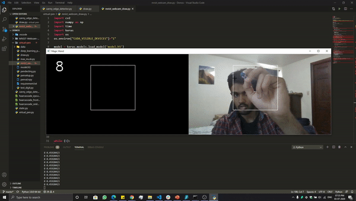

# virtual_pen_MNIST
This is a python program which uses deep learning and image processing to create virtual pen where the user can hover with the configured colour tip over the webcam to write digits. The deep learning model trained using MNIST Datasets (Extract the data.rar) is used to recognize the digits. It uses keras for deep learning and opencv for image processing.

# Step 1 Train the Deep Learning Model
# Step 2 Setup your Pen detection

## Demo

